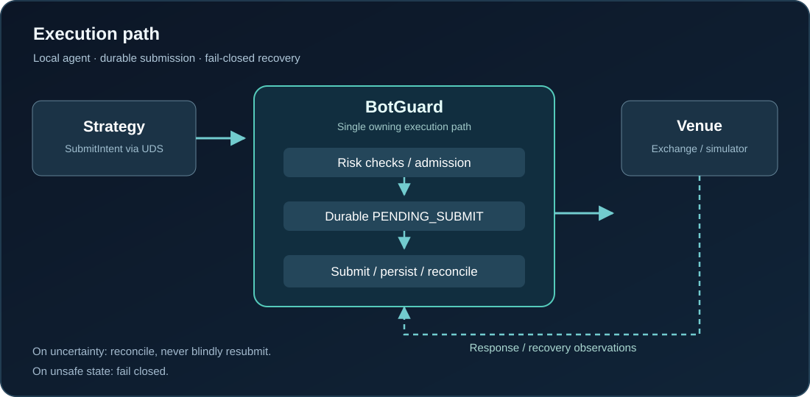

# BotGuard

**A local, venue-agnostic execution-safety layer for automated trading systems.**

[](CMakeLists.txt)
[](README.md)
[](CMakeLists.txt)
[](BOTGUARD_PLAN.md)

**BotGuard does not generate trading signals or predict prices.** It sits between a strategy and its execution venue, checks whether an order is safe to submit, persists state before external side effects, and recovers after uncertain outcomes or crashes.

> **Engineering focus:** deterministic pre-trade risk, durable idempotency, crash recovery, bounded local IPC, and fail-closed operation.



## The failure BotGuard is designed to handle

An exchange accepts an order, but the submit response is lost. The process is then terminated. Should a strategy resend the order after restart?

**Not blindly.** BotGuard persists the intent, recovers state through venue reconciliation, and rejects a retry using the same `client_order_id` instead of submitting a duplicate.

The repository includes a **fault-injecting persistent simulator** that exercises this case with real SQLite files, real process termination (`SIGKILL`), restart reconciliation, and duplicate-intent retries.

## Key design choices

| Area | Approach |
| --- | --- |
| **Execution ownership** | BotGuard owns the risk → durable pending state → external submit → final/uncertain state sequence; the strategy does not receive an approval to submit independently |
| **Risk evaluation** | `RiskEngine::Evaluate()` is designed without I/O, logging, heap allocations or mutex acquisition; financial values use fixed-point arithmetic |
| **Durability** | SQLite records order state and append-only lifecycle events; ambiguous outcomes require reconciliation |
| **Idempotency** | Stable client order identity prevents blind duplicate submissions after timeouts and restarts |
| **IPC** | Linux `AF_UNIX/SOCK_SEQPACKET` protocol with versioned frames and bounded I/O deadlines |
| **Safety controls** | Durable kill switch, controlled resume, single runtime owner, and fail-closed recovery |
| **Testing** | GoogleTest, process-level fault injection, crash/restart scenarios and a dedicated risk microbenchmark |

BotGuard is latency-sensitive, **not an HFT platform**. Performance targets are measured, not claimed as end-to-end latency guarantees.

## Quick start — reproduce the lost-response failure

**Requirements:** Linux, C++23-capable compiler, CMake 3.20+, SQLite3 3.24+ and development headers. For this demo, GoogleTest and the optional Kalshi adapter are disabled.

```bash
git clone https://github.com/Orurh/botguard_mvp.git
cd botguard_mvp

cmake -S . -B build -DCMAKE_BUILD_TYPE=Release \
  -DBOTGUARD_BUILD_TESTS=OFF \
  -DBOTGUARD_BUILD_KALSHI_ADAPTER=OFF
cmake --build build -j
./build/botguard_failure_demo
```

The simulator exercises multiple failure boundaries, including a venue accepting an order just before its response is lost. Its expected invariant is **no second venue submission for the same durable order identity**.

Selected expected checks:

```text
scenario=ACCEPTED_BUT_RESPONSE_LOST
  venue_submit_count=1
  recovered_state=OPEN
  retry_result=DUPLICATE_CLIENT_ORDER_ID
  second_submit=false
  result=PASS

scenario=RECONCILIATION_UNAVAILABLE
  recovery=FAIL_CLOSED
  trading_capability=ABSENT
  second_submit=false
  result=PASS
```

For the complete crash matrix and explanations, see the [engineering reference](docs/ENGINEERING_REFERENCE.md#primary-failure-simulator-demo).

## Build and test

With **GoogleTest** installed and discoverable by CMake:

```bash
cmake -S . -B build -DCMAKE_BUILD_TYPE=Debug \
  -DBOTGUARD_BUILD_TESTS=ON \
  -DBOTGUARD_BUILD_KALSHI_ADAPTER=OFF
cmake --build build -j
ctest --test-dir build --output-on-failure
```

The repository also includes a simulator-backed local UDS agent, C++/Python socket clients, a Kalshi **demo-only** integration slice, and an opt-in `RiskEngine::Evaluate()` microbenchmark. Details and commands are in the [engineering reference](docs/ENGINEERING_REFERENCE.md).

## Repository map

```text
src/
  risk/       Risk checks, reservations, order identity
  execution/  Durable state, submit coordination, reconciliation
  agent/      UDS protocol, server and client
  demo/       Persistent fault-injecting venue and simulator runtime
  app/        Executables and demos
tests/        Unit, storage, protocol and integration tests
bench/        Risk-engine microbenchmark
clients/      Python UDS client
docs/         Architecture diagram and technical reference
```

## Documentation

- [Engineering reference](docs/ENGINEERING_REFERENCE.md) — full simulator crash matrix, build options, UDS agent, SQLite recovery invariants, Kalshi demo commands and benchmarking.
- [Product and implementation plan](BOTGUARD_PLAN.md) — goals, scope, safety rules and non-goals.
- [Architectural decisions](DECISIONS.md) — technical trade-offs and invariants.

## Scope and limitations

**This is an experimental engineering prototype, not audited or production-certified trading infrastructure.** Its venue-neutral core and simulator can be exercised without exchange credentials. The optional Kalshi integration is explicitly for the **demo API** and is not evidence of production readiness. No profitability, absolute latency, or universal exactly-once guarantee is claimed.

The project prioritizes **correctness, deterministic behavior, recoverability and explicit failure states** over premature optimization.
